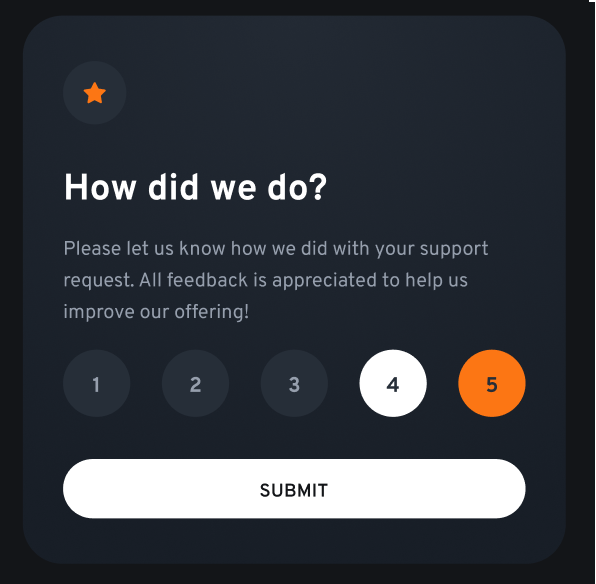

## Table of contents

- [Overview](#overview)
  - [The challenge](#the-challenge)
  - [Screenshot](#screenshot)
  - [Links](#links)
- [My process](#my-process)
  - [Built with](#built-with)
- [Author](#author)

## Overview

### The challenge

Users should be able to:

- View the optimal layout for the app depending on their device's screen size
- See hover states for all interactive elements on the page
- Select and submit a number rating
- See the "Thank you" card state after submitting a rating

### Screenshot

### Links

- Solution URL: [Frontend Mentor Link](https://www.frontendmentor.io/solutions/interactive-rating-component-vhOP4OT3Ws)
- Live Site URL: [Interactive Rating Component by Romeo Codes](https://interactiveratingcomponentrc.netlify.app/)

### Built with

- Semantic HTML5 markup
- CSS custom properties
- Flexbox
- CSS Grid
- Mobile-first workflow

## Author

- Website - [Romeocodes](https://linktr.ee/romeocodes)
- Frontend Mentor - [@Romeo899](https://www.frontendmentor.io/profile/Romeo899)
- Twitter - [@romeocodes](https://x.com/romeocodes)

